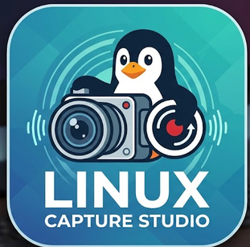
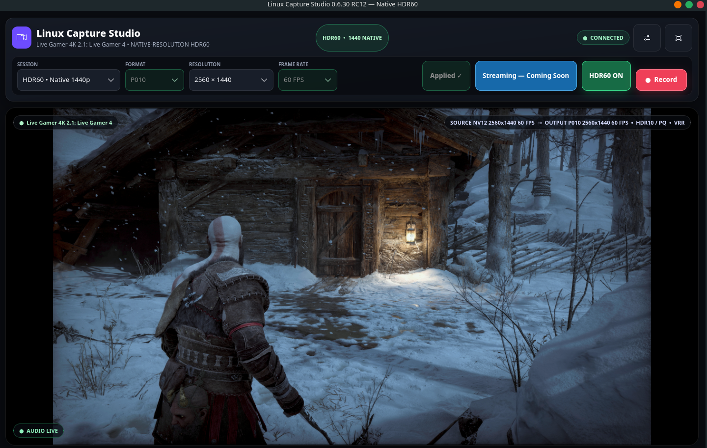
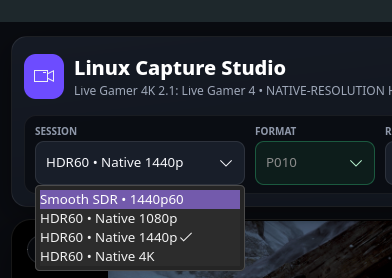
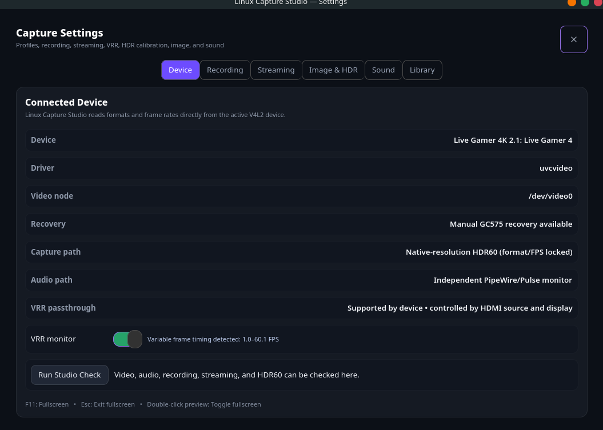
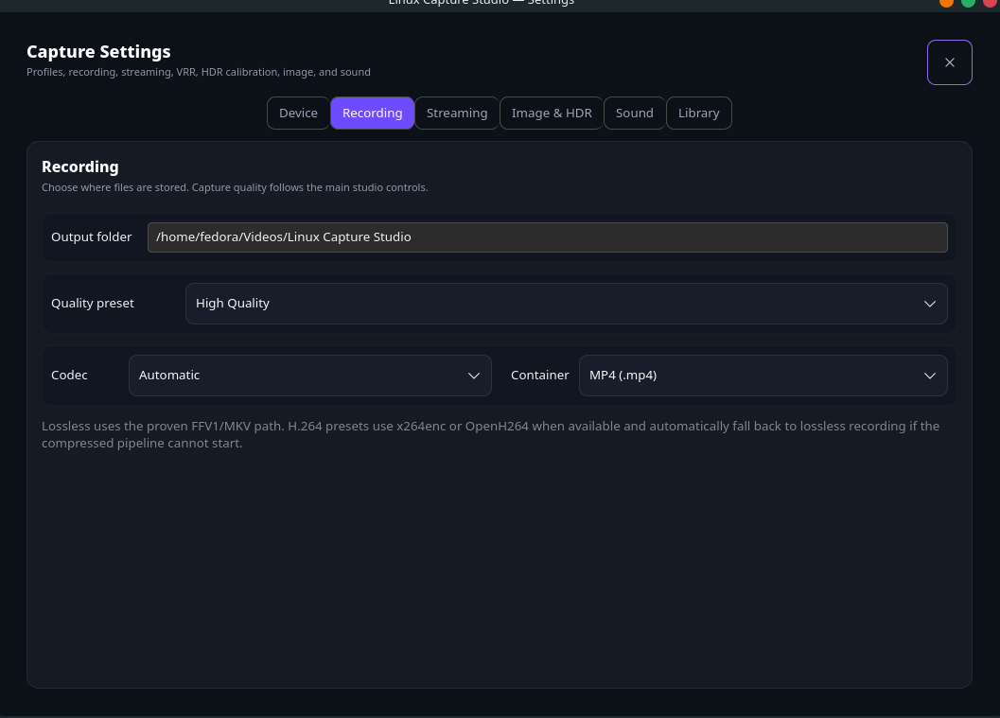
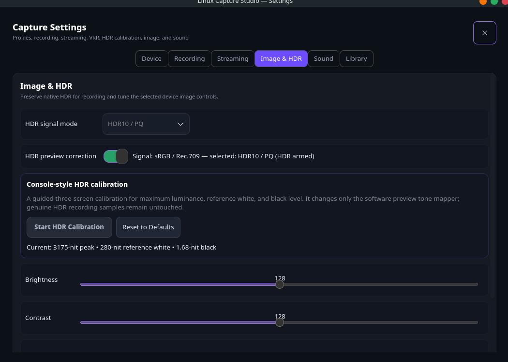
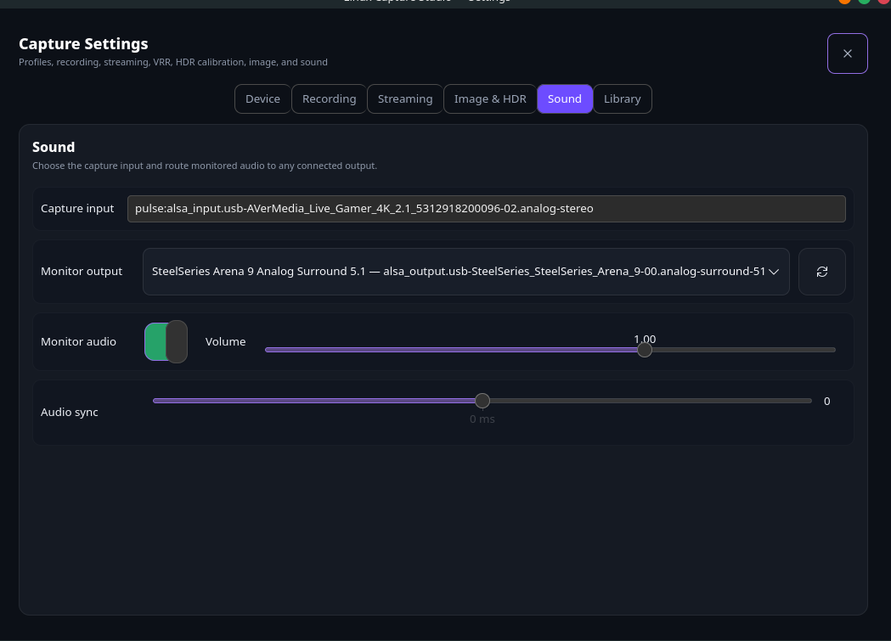

# Linux Capture Studio 0.6.30

<p align="center">
  
</p>

<p align="center"><strong>Native GTK4/GStreamer capture, HDR preview, and lossless recording for Linux.</strong></p>

Linux Capture Studio is a native GTK4 video-capture and recording application for Linux. It uses GStreamer and V4L2 and supports capture cards, 4K60 video, HDR, P010, audio controls, fullscreen preview, recording profiles, and automatic capture-device recovery.

<p align="center">
  
</p>

## Screenshots

### Main capture window



| Session selection | Connected device |
|---|---|
|  |  |

| Recording | Image and HDR | Sound |
|---|---|---|
|  |  |  |

## Quick start

```bash
rm -rf build
meson setup build
meson compile -C build
./scripts/run-linux-capture-studio.sh
```

Install for the current user without sudo:

```bash
./scripts/install-user.sh
```

Run release validation:

```bash
./scripts/release-check.sh
```

## One application, one launcher

V0.6.30 keeps native-resolution HDR60, fixes the KDE Apply crash, and adds a three-step console-style HDR calibration wizard. Start the studio only with:

```bash
./scripts/run-linux-capture-studio.sh
```

Use the new **SESSION** menu inside the main window to select:

- Smooth SDR • 1440p60
- HDR60 • Native 1080p
- HDR60 • Native 1440p
- HDR60 • Native 4K

Linux Capture Studio stages the selected session and normally rebuilds the capture pipeline inside the same application window after you press **Apply Changes**. On the GC575, the specific 1080p P010 → native 4K60 MJPEG transition uses one controlled xHCI reset and automatically reopens the application directly in 4K; this avoids the card firmware's repeated `TRY_FMT` failure. The last confirmed session is remembered in:

```text
~/.local/state/linux-capture-studio/session-mode
```

No reset is used for ordinary settings changes. One controlled xHCI reset is used only when the GC575 must cross from its genuine P010 transport into native 4K60 MJPEG. Run through `./scripts/run-linux-capture-studio.sh`; launching the binary directly cannot complete that protected transition.

## Integrated Studio Check

Open **Settings → Device** and press **Run Studio Check**. It checks the active video device, capture audio, lossless recording components, and native HDR60 capability from inside the application. Streaming is shown as Coming Soon. Separate test launchers are not required.

## HDR60 behavior

HDR60 now opens a physical capture source at the selected resolution. Lower-resolution upscaling is disabled.

- **Native 1080p:** opens a 1920×1080/60 source.
- **Native 1440p:** opens a 2560×1440/60 source.
- **Native 4K:** opens a 3840×2160/60 source.

Linux Capture Studio prefers native P010. When the Linux UVC interface exposes only NV12 or MJPEG at 1440p/4K60, it keeps the full native resolution and converts pixel format only. It will not use 1080p or 1440p as a hidden source for a selected 4K session.

## Sound

Live monitoring uses an independent GStreamer pipeline. A capture-audio failure does not shut down the video preview. The application prefers the matching PipeWire/PulseAudio source and routes it to the selected output device.

## Recording and streaming

- Lossless FFV1/MKV remains the safest recording mode.
- H.264 recording falls back to lossless when the compressed encoder cannot start.
- YouTube and Twitch remain visible but disabled as **Coming Soon**.
- The Flatpak therefore does not request network permission.

## Apply workflow

Capture changes are staged before they touch the hardware. Changing Session, Format, Resolution, Frame Rate, HDR, or the HDR signal mode shows **CHANGES PENDING** and enables **Apply Changes**. Recording and streaming remain disabled until the pending mode is applied.

Pressing **Apply Changes** pauses the preview, releases the capture interface, and rebuilds the selected pipeline. The mode is not marked applied until at least ten real video frames arrive. If native 4K is rejected, the complete proven previous HDR session is restored instead of retrying 4K. The protected GC575 P010 → 4K MJPEG transition briefly restarts the application through the integrated launcher after one controlled xHCI reset.


## Build on Fedora

```bash
sudo dnf install -y \
    gcc meson ninja-build pkgconf-pkg-config \
    gtk4-devel gstreamer1-devel gstreamer1-plugins-base-devel \
    gstreamer1-plugin-gtk4 gstreamer1-plugins-base \
    gstreamer1-plugins-good gstreamer1-plugins-bad-free \
    gstreamer1-plugin-libav v4l-utils alsa-utils usbutils pulseaudio-utils

rm -rf build
meson setup build
meson compile -C build
./scripts/run-linux-capture-studio.sh
```

AVerMedia GC575 is the primary tested device. Elgato and other UVC/V4L2 devices remain capability-driven experimental targets.
## Build the Flatpak

Fedora prerequisites:

```bash
sudo dnf install flatpak flatpak-builder
```

Create a local `.flatpak` bundle:

```bash
./scripts/build-flatpak.sh
```

The manifest uses the supported GNOME 50 runtime. It grants Wayland, PulseAudio/PipeWire, GPU, V4L2/ALSA device, and Videos-folder access. Network access is intentionally omitted while streaming is disabled.

## HDR preview correction and calibration

The on-screen preview is tone-mapped to the desktop while the recording branch remains untouched. Under **Settings → Image & HDR**, built-in calibration controls adjust display peak luminance, paper white, black floor, and preview saturation. Press **Apply HDR Calibration** to update the active GLSL preview shader live; the values are saved per capture device.

Settings now opens as a normal resizable top-level window. It can be moved independently instead of remaining attached to the toolbar button.
